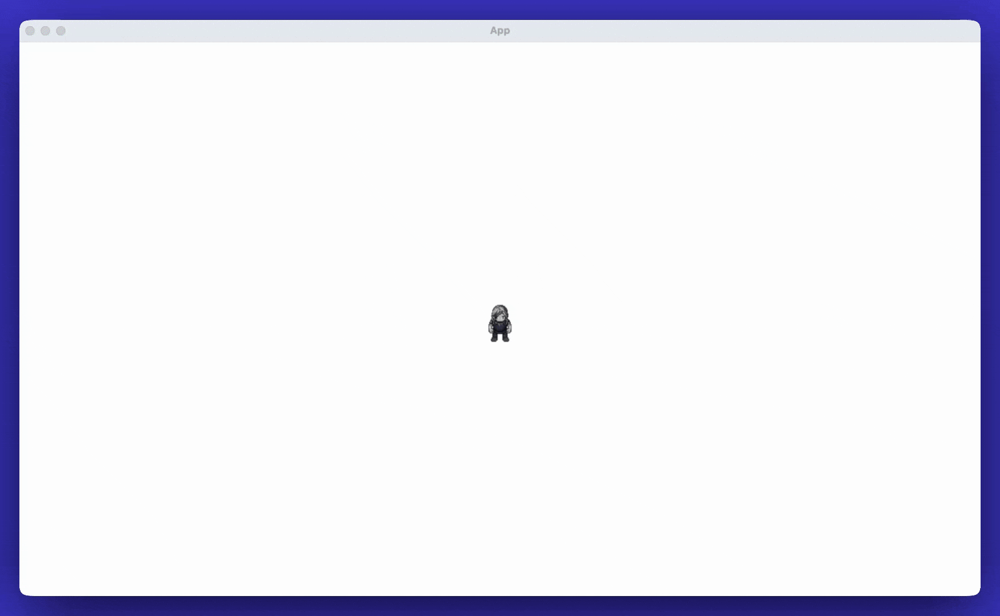

# The Impatient Programmer's Guide to Bevy and Rust

This repository contains the source code for "The Impatient Programmer's Guide to Bevy and Rust: Build a Video Game from Scratch" tutorial series.

## License

**The tutorial code in this repository is licensed under the MIT License.** See the [LICENSE](LICENSE) file for details.

## Chapters

### [Chapter 1: Let There Be a Player](https://aibodh.com/posts/bevy-rust-game-development-chapter-1/)

Learn to build a video game from scratch using Rust and Bevy. This first chapter covers setting up your game world, creating a player character, and implementing movement and animations.



### [Chapter 2: Let There Be a World](https://aibodh.com/posts/bevy-rust-game-development-chapter-2/)

Learn procedural generation techniques to create dynamic game worlds.


### [Chapter 3: Let The Data Flow](https://aibodh.com/posts/bevy-rust-game-development-chapter-3/)

Learn to build a data-driven character system in Bevy. We'll use a RON file to configure character attributes and animations, create a generic animation engine that handles walk, run, and jump animations, and implement character switching.


## Getting Started

Each chapter has its own directory with a complete, runnable project. Navigate to the chapter directory you want to explore and run:

```bash
cd chapter1  # or chapter2, chapter3
cargo run
```

## Community

- [Join our Discord community](https://discord.com/invite/cD9qEsSjUH) to get notified when new chapters drop
- Connect with me on [Twitter/X](https://x.com/heyfebin)
- Connect with me on [LinkedIn](https://www.linkedin.com/in/febinjohnjames/)

